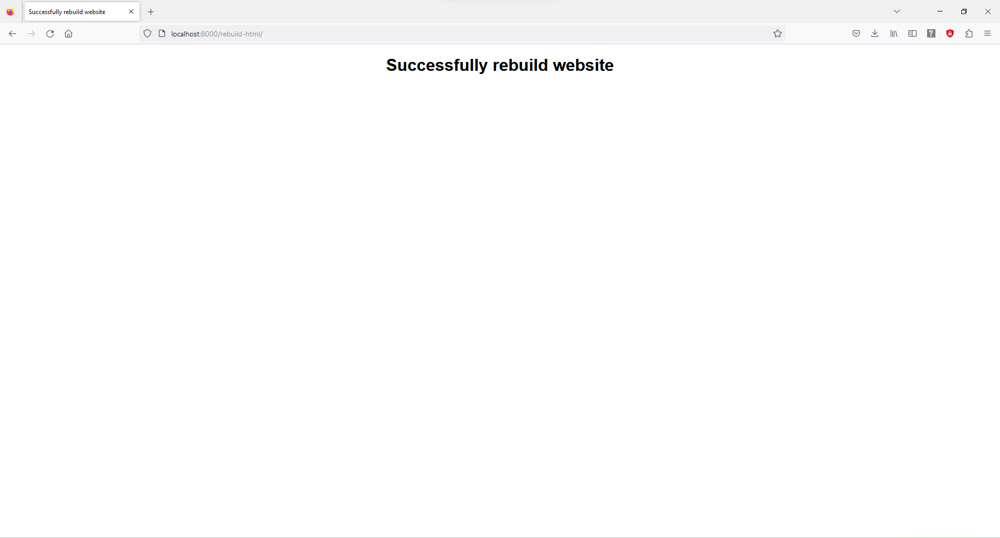
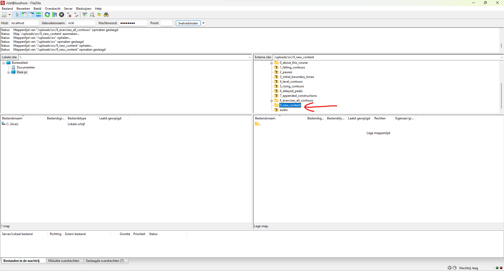

# Content location

To adjust the content currently on the website, you first have to go to the folder that contains the content currently on the website. This is the `uploads` folder. You can get here in two ways:

1. The first way is by directly accessing the server, however this is probably not very pratical.
2. The second way is by using a FTP-server. Assuming that this has been set up correctly, you can use any FTP-client you want. Below is an example using [Filezilla](https://filezilla-project.org/) which is free.

* When you first start the Filezilla client, you will see a screen similar to this. 

In the two left windows are the files on your own computer. On the right are the files on the server. 

* At the top you have to fill in host (the address of the FTP-server), username, password and the port number of the server. These depend on how the server is set up. Once connected, the folders on the server will show up in top right window and if you select a folder, then in the bottom right window the contents of this folder are shown:

* Now go into the `src` folder. Here all the contents are stored.

# Changing content

To change content, simply navigate to the file where you want to change something. The file structure follows the course content structure, so it should be easy to find. As an example, to change something on the page '0.1 The analysis', we move into `0_about_this_course` and then right-click the file `0_1.md` and select `view/edit`. It then opens with your PC's standard program and you can change it. 

To learn about Markdown, go to [this page](https://www.markdownguide.org/). Once your done editing, save the file. Filezilla will give this popup, select yes.

The file is now changed on the server. To apply the changes, go in your browser to the address `<domain>/rebuild_website.html` and click the button:

Once completed successfully, you will be redirected to the following page:

If you are not logged in as administrator, you will be prompted to log in.

The standard credentials are:
 * Username: todi-admin
 * Password: todi12345

However these (should) have probably been changed.

Now the content of the website has been changed!
Before:

After:

The above steps work for any kind of content (pictures, etc.).

# Adding new content
To add new content, follow the same steps as in this example.
1. Go to the correct folder or create a new one:

2. Create the new file using right mouse button:

3. Open, edit and save it:

4. In the `uploads` folder, open `SUMMARY.md` and add your newly created Markdown file at the appropriate place:

5. Rebuild the website as described above:

The newly created content is now on the website!

# Creating new exercises
The exercises follow a certain specification in json. Exercise 8A is used as example.
1. The first part of the specification are the `items`. This is one item:

This corresponds to one sentence in an exercise. It exists of the following:
* `sentence`: The words in the sentence. Each voiced portion (VP) is enclosed with square brackets. If the user should be able to select the annotation for a VP, a number corresponding to the choice (more on this below) should be added directly after. For example "[proberen]1". This means that for the word "proberen" the user can choose the annotations in option set 1.
* `key`: The correct key for the user fillable VPs, from left to right.
* `contour`: The name of the file containing the contour image. It should be in an `img` folder directly in the chapter folder. So in our example `/uploads/src/9_new_content/img/8A-1.png`.
* `audio`: The name of the file containing the audio. It should be in an `audio` folder directly in the chapter folder. So in our example `/uploads/src/9_new_content/audio/8A-1.mp3`.
* `wav`: The name of the WAV-file. It should be in a `wav` folder directly in the chapter folder. So in our example `/uploads/src/9_new_content/wav/8A-1.wav`.
* `textgrid`: The name of the TextGrid file. It should be in a `TextGrid` folder directly in the chapter folder. So in our example `/uploads/src/9_new_content/TextGrid/8A-1.TextGrid`.
2. The second part of the specification are the `choices`. These are the possible option sets of annations that users can choose:

These option sets, including their layout, correspond directly to the drop-down menu in the exercise. These numbers are the indices of each option set and are the ones that have to be used in the `sentence` directly after the square brackets to assign an option set to a VP.