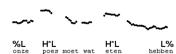

Pre-nuclear H\*L
----------------

Frequently, more than one H\*L appears in the same phrase.

Here are some examples.

Notice that the way the H\*L is realised is different in final position from nonfinal position. While falls will vary in slope, in final position the fall to L is usually steep and in nonfinal position it is usually more gradual, and in fact depends on how long the stretch is between the two accents. In the first example, the stretch "niet altijd op 'n mis" contains six syllables, while in the second the stretch "heeft nog" contains only two.

Here are three more examples. The first two have two accents each and the third has four accents.

* * *

