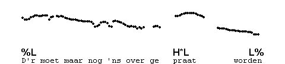
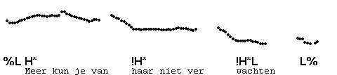
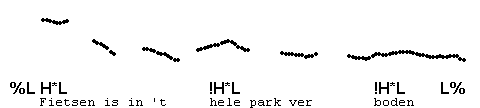

Low preheads
------------

The part of the utterance before the first accent, known as the **prehead**, is usually low in pitch, but may also be falling from mid to low if the prehead is particularly long. These preheads are transcribed %L.

When the first syllable of the IP is accented, there is no space for the low prehead, although frequently the pitch can be seen to rise in the first half of the accented syllable, when pronounced with H\*(L). Even when this rising section is not present, which typically happens when the syllable begins with a voiceless consonant, the syllable sounds just like an accented syllable that is preceded by a low prehead which is physically there. We therefore transcribe them the same, with %L, which could thus be seen as the 'neutral' way to begin an IP.

