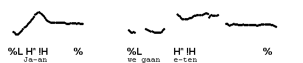
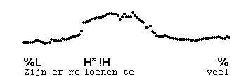
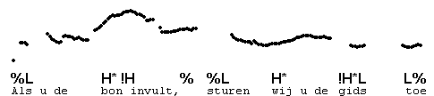
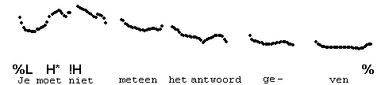
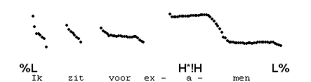
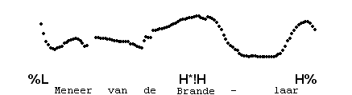

Vocative chant
--------------

A very characteristic contour is sometimes used to call somebody by name. It consists of a high level and a mid level tone. The H\* of course begins on the accented syllable, and the !H, the mid level, is realised on the last syllable, or on a stressed syllable, if there is one between the accented syllable and the last syllable. Often, the accented syllable and the syllable on which the !H begins are lengthened. When the accented syllable is the last syllable, the two levels are both pronounced on that syllable, which as a result is broken into two sections.

Transcription of the vocative chant (also "chanted call") is H\* !H %. The pitch accent H\* !H is single pitch accent, even though the !H may occur a few syllables after H\*.

The lengthening does not occur when the level pitch of H\* is spread over more than two syllables ("loenen te"):

No lengthening is used when the contour is used to mark continuation, which sometimes occurs in instructions which the speaker wishes to sound unproblematic.

Example:

The vocative chant is also used on utterances with an early accent, in which case each of the following unaccented words is likely to have a pitch level. These levels descend in the same way that series of downstepped accents descend. Here is an example.

As is clear from these examples, the last pitch level has mid pitch, rather than low pitch. For this reason, we transcribe the right-hand boundary as toneless: %. Vocative chants with L% and H% do exist, but are rare. The one with L% has a fully low-pitched final pitch level, and may make the speaker sound exasperated. Here is an example.

The vocative chant with H% is like H\*!H % with an added rise in the last part of the last pitch level. It may give an impression of wheedling. Here is an example.

