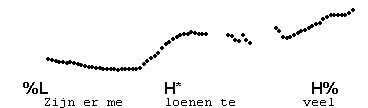
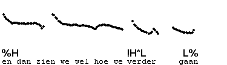
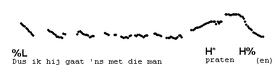
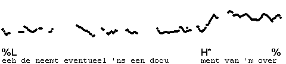
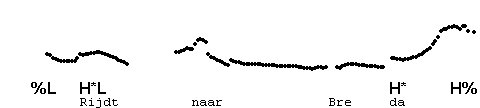

High rise
---------

Auditorily, an IP-final high rise begins at mid pitch, which continues until a rise at the IP-boundary. Usually, the mid pitch is reached late in the accented syllable, while the beginning is low, as is commonly the case for H\*. It is mostly used in questions.

We transcribe: H\* H%.

High rises are frequently used utterance-internally, to indicate that another IP follows.  
The following example has an accent on "praten". Listen to the whole utterance first.

In the next example, the first phrase is realised with H\*H%, followed by a single H\* in the second phrase, i.e., a level tone:

The following utterance illustrates a high rise in nonfinal position in IP, realised on a monosyllable.

