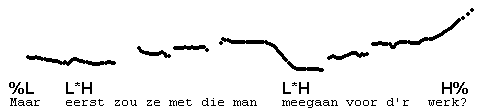
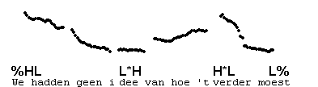
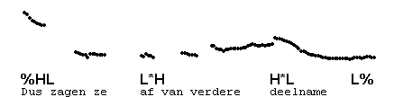
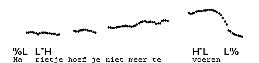
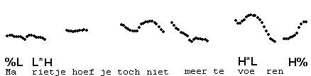
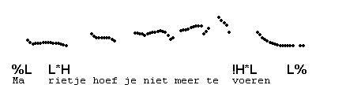

Pre-nuclear L\*H
----------------

L\*H also occurs non-finally in the IP. The accented syllable is low, and the climb to H may be faster or slower, depending on how far away the next accent is. We transcribe L\*H.

The first example shows a non-final L\*H with a slow rise followed by a final L\*H H%.

Before H\*(L), the same pre-final pitch pattern can be used: the accented syllable has L\*, then the rise follows to H\*. We transcribe this pre-nuclear rise as L\*H. The presence of the H after L\* describes the rising pitch up to the following H\*. In some pronunciations of this contour, there is a step-up from the end of the pre-H\* rise to the target of H\*, which is the realisation of H before H\*.

The prenuclear L\*H contrasts with L\*, which describes a low accent, followed by level low pitch until the next accent. This low level prenuclear accent is discussed in section 5.5.2.

We show this contour in the following examples. Those who are familiar with the television programme "Glamourland" may recognise this contour as one that Gert-Jan Drge, its presenter, frequently uses. The [falling prehead](../3_initial_boundary_tones/3_3.html), introduced in section 3.3, is typical of this contour.

In the following example, the prehead is low.

As said above, the H after L\* can sometimes be heard separately. In the next example, we can hear high pitch on "niet" (the target of H) lower pitch on "te", which lies between the two high targets, and high pitch on "voer" again (H\*).

**Downstep after L\*H**

Pre-nuclear L\*H may also appear before a downstepped !H\*. Again, the rise may be faster or slower, depending on the distance between the accents. In this contour, the H of L\*H is higher than the immediately following !H\*, which has the usual mid or low pitch, usually followed by L%.

Compare !H\*L with H\*L in this context, as in one of our previous examples, repeated here, where the pitch on "voer" is fully high.

