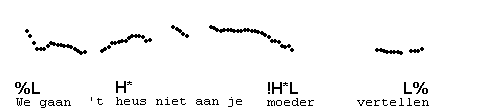
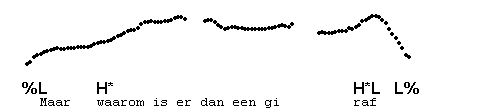
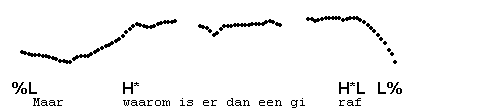
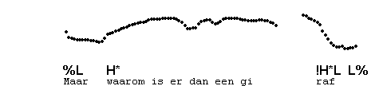
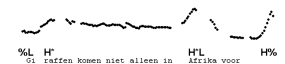
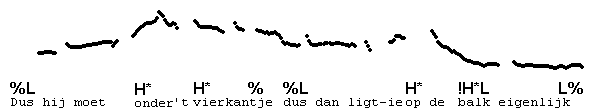

Singleton H\*
-------------

We have already come across singleton pre-nuclear H\* in contours with downstep-plus-spreading. Singleton pre-nuclear H\* can also appear in other contours. Here is an example of H\* before a non-downstepped H\*L.

Now compare this non-downstepped H\* H\*L contour with a contour that has downstepping and spreading, i.e., H\* !H\*L. Observe that the pitch fall for the final accent is earlier in the case of the downstepped contour. Both contours are informally known as the 'flat hat', but notice the difference between them.

In H\* H\*L contours, the second H\* may be considerably higher than the first: after a mid level plateau, the pitch goes up to the final H\*, and then falls. We consider the difference between this contour and one without a raised final peak to be a pitch range difference, and do not transcribe them differently. Compare the following two realisations of the same contour:

These two pronunciations of the same contour may be compared with H\* !H\*L, where the second accent has a downstepped !H\*L.

Here is an example of a 'flat hat' with a late, raised fall in combination with a H%.

Singleton H\* also occurs before H\* % and H\* H%. In such cases the pre-final H\* may be difficult to hear (and you might argue it is not there), unless the level pitch for the second H\* is a little lower than the level pitch of the preceding H\*. Here is an example.

In the next example, the IP is immediately followed by a %L H\* !H\*L %L contour.

