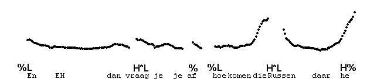
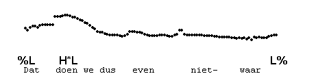
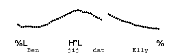
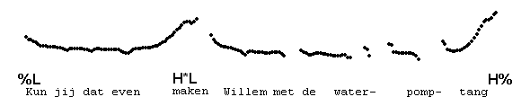
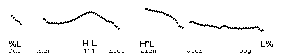
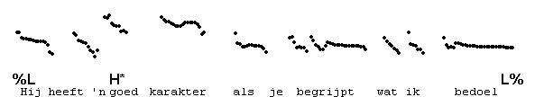
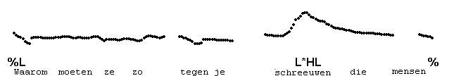
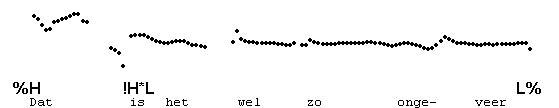
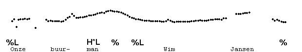
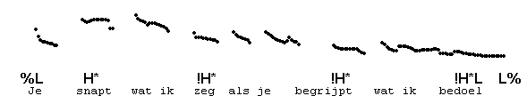

Tagged constructions
--------------------

The classic tag is a short word appended to a sentence to appeal to the listener in various ways. They include _h�, hoor, nietwaar, toch_ and _zeg_. Their meaning broadly corresponds to English tags like _is it, wasn't he_, etc. Unlike these English tags, the Dutch tags are unaccented, and included in the preceding IP. They are intonationally idiomatic, and cannot therefore freely occur with all contours. For instance, the tag _h�_ always occurs with H\*L H% (or its delayed form L\*HL H%) on the preceding accented word, as in the following example.

The other tags, too, may show a bias towards H\*L H%. However, here is an example with H\*L L% and _nietwaar_.

Vocatives are similarly tagged onto the sentence, and kept in the same IP. A combination of a word and a vocative, such as _(Wil je) koffie, Dik?_ therefore sounds the same as a compound, _Koffiedik_ in this case. The vocative need not be a name, but could be any description of the addressee used as a vocative, including expletives. Here are some examples.

An entire clause may be appended in this way, by way of cohesion marker. In the following example, the clause _als je begrijpt wat ik bedoel_ is similar in meaning to _of course_.

Referents of pronouns may be made explicit as unaccented, appended items, as in the next example.

Various approximative items, like ongeveer, of zoiets, en dergelijke are similarly treated.

These unaccented tags differ from accented words that appear in similar positions, but represent different constructions, as shown by the following examples.

* * *

