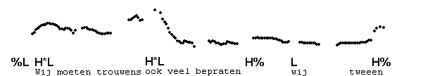
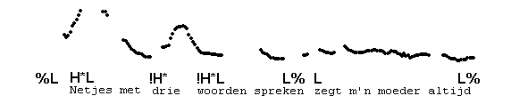
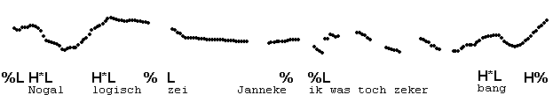
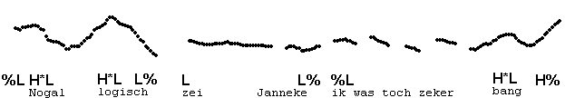
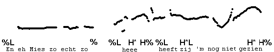

Unaccented IPs
--------------

In some utterances with more than one IP, there may be a non-initial IP which has no accent. Such unaccented IPs may consist of reporting clauses ("zei Jan"), or of a rewording of the contents of a preceding IP.

Here are some examples. The first has a rewording of "wij" as "wij twee�n", the second and third have a reporting clause. Unaccented IPs usually have the same post-accentual tones as the IP they are attached to. For example, if the preceding IP ends in H\*L L%, the unaccented IP will have L L%, and similarly H\*L H% will be followed by L H%. To indicate the close connection between the unaccented IP and the preceding IP we do not transcribe an initial %.

In the next two examples, the unaccented IP is not utterance-final; the first IP has a half-completed fall in the first example, and a fully low %L in the second one.

* * *

