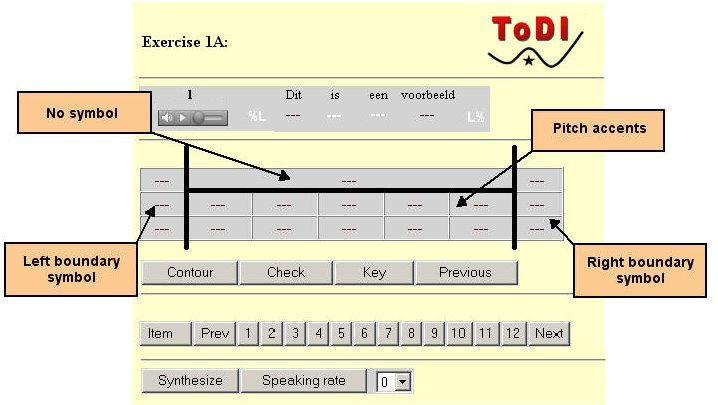

User interface
--------------

The appearance and user interface of this course will very much depend on the browser you use. We have discovered that there may be problems with older versions of some browsers. We regret this very much, our testing indicates that all newer versions of Internet Explorer should work fine. If you have problems with your browser or audio you can try the Mozilla browser ([Mozilla Full installer](../software/MozillaFullInstaller.zip) or [Mozilla ZIP version](../software/mozilla-win32-1.6.zip)) and the Quicktime audio player ([QuickTime Full installer](../software/QuickTimeFullInstaller.zip) or [QuickTime ZIP version](../software/QuickTimeInstallerEN.zip)). For unpacking the zip files you can find a lot of programs on the internet, for example you can download [quickzip](http://qzip.cjb.net/) or [ZipGenius](http://www.zipgenius.it/index_eng.htm).

#### Audio examples

If you open a link to an audio example (by clicking the left mouse button), the sound file is downloaded and played by a "helper application", as defined by your web browser.

If you want to listen to an audio example repeatedly, it is usually best not to click the audio link again, but to supply the appropriate command to the helper application (mostly a play button). This avoids creating a trail of instances of the helper application.

It may occasionally happen that the picture that is provided with the audio example (the graphic representation of the pitch contour) is incomplete. Use the "refresh" option in your right mouse button menu to correct this.

It is also possible to save sound files to disk, so you can use them in your speech analysis software. Click the right mouse button, and select the appropriate menu option to do this.

All sound files used in this course are 16-bit, 16KHz Windows Wave files (extension .wav), and can be used with speech analysis programs such as Praat, which is widely used.

A copy of Praat (Unix or PC) can be obtained from [Praat home page](http://fonsg3.hum.uva.nl/praat/).

#### Exercises

The exercises form an essential part of the course. Learning to apply the ToDI system is largely a matter of gaining practical experience. The exercises require a JavaScript compatible browser.

The examples in the exercises are presented as a string of words and a string of boxes, one for each word. Below the example you find a console with boxes, each box representing a symbol, arranged in three groups, Initial boundary symbols, Final boundary symbols and Pitch accent symbols. This is your symbol bank.

Only boxes that are marked with a black dotted line can be filled in by the user. Boxes with a white dotted line cannot be edited; they are not relevant for this exercise. To do so, click on the box, which makes available the appropriate section of the symbol bank, from which you can then make your choice. It will appear in the relevant box in black font. You can correct your choice at any time, including replacing with 'no symbol'. Boxes that cannot be filled in or in which a symbol has already been selected are given in white font. The full set of symbols in the symbol bank will only gradually become available, in tune with the unfolding of the explanation in the text.

Below the symbol bank, there are controls that allow you (a) to inspect the F0 contour (Contour), (b) to check your transcription (Check), (c) to request the correct transcription (Key) and (d) to inspect the previous transcription you entered for the same utterance, if available (Previous).

At the bottom of the screen, you will find a synthesis facility with which you can synthesize the intonation contour of the transcription given in the boxes on the basis of a diphone speech file. A tempo control allows you to adjust the speed of utterance. Any legitimate transcription will be synthesized. You can compare the original with the synthesized version to see if the intonation patterns are the same, and if they are not, try another. You could take any example and go through all possible transcriptions, just to see what they sound like.

A second, and rarer type of exercise ('Part B') provides you with a multiple choice of three transcriptions for a given example. Its lay out is self-evident.

* * *

[Proceed with section 0.3](about3.htm)
