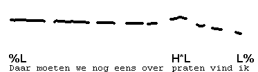
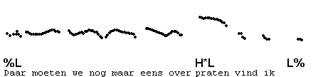

Some examples
-------------

The following examples illustrate ToDI transcriptions of some contours with a single accent in a single IP. (Don't worry about the transcription symbols, which will all be dealt with later in the course.)  
Listen to the synthesized utterance transcribed below:

<TABLE BGCOLOR="lightgrey" BORDER=0 CELLPADDING=4 CELLSPACING=0 onclick="play_sound('./audio/052')">
<TR>
<TD ROWSPAN=2 WIDTH=40>

</TD>

<TD>Daar moeten we nog eens over</TD><TD COLSPAN=2>praten vind ik</TD>

<TR><TD>%L</TD><TD>H*L</TD><TD ALIGN=RIGHT>L%</TD></TR>

</TABLE>

In the text, we often provide graphic representations of pitch contours, like the one below. To hear them, just click anywhere in the grey area.

<TABLE BGCOLOR="lightgrey" BORDER=0 CELLPADDING=0 onclick="play_sound('./audio/052')">
<TR>
<TD>

</TD>
</TR>
</TABLE>

In these representations, the ToDI transcription symbols are aligned with the corresponding pitch events in the contour. The beginning of the gloss below the transcription as well as all pitch accented syllables are lined up with the corresponding tone symbols.

Now compare this synthesized utterance with the same utterance in natural speech, spoken with the same intonation contour:

 

You may also find that the tempo of the human speaker is faster than that of the synthesized voice. In general, computer speech tends to be slower than natural speech. Remember you can always adjust the tempo of the synthesized utterance.

* * *

