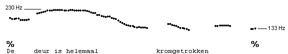
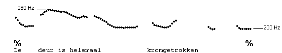
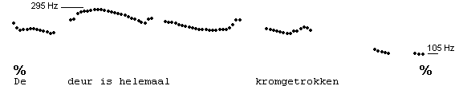
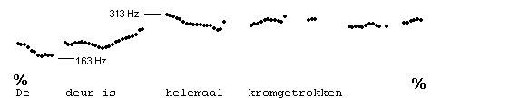
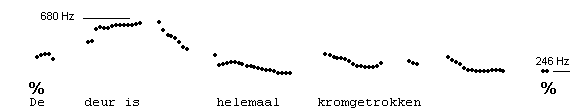
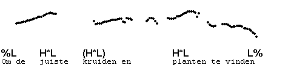

Sameness and difference
-----------------------

In the previous section, you have seen that the same intonation contour can be produced by different speakers, or even be produced in audibly different ways by a machine. That is, in this course, you are not trained to describe all the differences you can hear, but only those that determine the linguistic identity of a contour, in other words, only the **contrastive** differences.

Very large (but not linguistically contrastive) phonetic differences may exist between the same contours. One source of variation is the **pitch span**. Listen to the following three pronunciations of the sentence "De deur is helemaal kromgetrokken". The highest pitch and the low end pitch are indicated in Hz.

 

 

 

In general, the wider the pitch span, the more emphatic will be the pronunciation. The point here is that all three pronunciations represent the same sentence, spoken with the same intonation contour. We can change the sentence by replacing "kromgetrokken" by "scheefgetrokken", or we can change the intonation contour by pronouncing the sentence like this:

 

Variations in **pitch register** will move a contour up or down in the speaker's pitch range. When women imitate the speech of men, they usually bring their pitch down, and pronounce everything at a lower register (for them), while conversely, men will raise their register when imitating the speech of children or women. Here is an example of a sentence pronounced at two registers by the same speaker.

 

 

Manipulations of the pitch span and the pitch register can have very dramatic communicative effects, but this course is not concerned with these aspects of speech production.

Perhaps unexpectedly, linguistically different contours may be very similar phonetically. Frequently, this situation arises for pre-nuclear pitch accents in the IP: we may not be certain whether it is there or not. In such cases, it will not make much of a difference whether we transcribe a pitch accent, since with or without, the result sounds much the same. Here is an example, with the doubtful pitch accent placed in brackets. (Don't worry about the transcription symbols, which will all be dealt with later in the course.)

 

When transcribers come up with different analyses of the same utterance, this either means that they have come upon a doubtful utterance, in which case both transcriptions have something to recommend themselves, or one of the transcribers has made a error. Some of those errors are well-known, and easy to identify. We will identiy each of these as "frequent error no#" at the point in the course where they are best dealt with.

* * *

