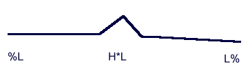

Overview of symbols and conventions
-----------------------------------

In the ToDI transcription system, an intonation contour is a melodic pattern which occurs in an Intonational Phrase. Each contour consists of a number of tones, **H**(igh) and **L**(ow). The notation T is used to refer to either H or L. These tones occur in two locations:

1.  at the edges of Intonational Phrases
2.  at accented syllables

Intonational Phrases are demarcated by %. Not every edge will have a tone. Tones occurring at IP edges are notated %T (initial boundary tone) or T% (final boundary tone). Every accented syllable is marked by a tone or a cluster of tones, called a 'pitch accent'. The first tone of a pitch accent is notated T\*. A T\* may be followed by further tones to describe the movement from the accented syllable onward.

Here is an example:

All the symbols will be explained in the text. By way of quick reference guide, a list of each element is given, as well as a list of all pitch accents, with approximate indications when they are used.

### Symbols

<TABLE BGCOLOR="lightgrey" WIDTH="100%" BORDER=0 CELLPADDING=4 CELLSPACING=0>

<TR><TD WIDTH="15%">H*</TD><TD WIDTH="15%">L*</TD><TD WIDTH="*">high/low accent</TD></TR>

<TR><TD>H</TD><TD>L</TD><TD>upward/downward movement after L*/H*</TD></TR>

<TR><TD>H%</TD><TD>L%</TD><TD>rising/low ending of IP</TD></TR>

<TR><TD>%H</TD><TD>%L</TD><TD>high/low beginning of IP</TD></TR>

<TR><TD COLSPAN=2>%HL</TD><TD>Initial falling pitch not marking accent</TD></TR>

<TR><TD COLSPAN=2>%</TD><TD>half-completed fall/rise at end of IP</TD></TR>

<TR><TD COLSPAN=2>!H*</TD><TD>downstepped H*</TD></TR>

</TABLE>

### The pitch accents, in the order as they appear in the symbol bank:

<TABLE BGCOLOR="lightgrey" WIDTH="100%" BORDER=0 CELLPADDING=4 CELLSPACING=0>

<TR><TD WIDTH="15%">H*L</TD><TD WIDTH="*">High fall from accented syllable</TD></TR>

<TR><TD>!H*L</TD><TD>Low fall from accented syllable, also called 'downstepped fall'</TD></TR>

<TR><TD>H*</TD><TD>High level from accented syllable</TD></TR>

<TR><TD>!H*</TD><TD>Lowered level from accented syllable, also 'downstepped level'</TD></TR>

<TR><TD>H*LH</TD><TD>Pre-final steep fall followed by a gradual rise towards the next accented Syllable, also 'pre-nuclear fall-rise'</TD></TR>

<TR><TD>L*!HL</TD><TD>Low rise fall from accented syllable, also 'downstepped delayed peak'</TD></TR>

<TR><TD>L*H</TD><TD>Rise from low from accented syllable</TD></TR>
<TR><TD>H*!H</TD><TD>Vocative chant</TD></TR>

</TABLE>

The melodic shape of the contour is defined by the consecutive contour shapes defined by the boundary tones and the pitch accents.
