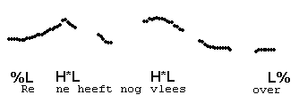
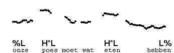

Phrasing, accentuation and melody
---------------------------------

An intonation transcription contains three elements:

1.  phrasing
2.  accentuation
3.  melody

We will briefly discuss these three aspects separately. However, do bear in mind that such a separation is artificial, and serves only an expository purpose. Your understanding of the phrasing of utterances is intimately tied up with your understanding of the accentuation and the melodic aspects: in any given utterance the three aspects are always considered together.

### Phrasing

Speech is not simply a continuous string of smoothly concatenated spoken words. For one thing, speakers may remain silent for brief periods of time at largely unpredicatble points, or utter noises like err or erm. These discontinuities are known as **hesitations**. For another, speech is "chunked up" in a way that somehow reflects the structure of the sentence or sentences. This is known as the **prosodic phrasing**. The more noticeable of such prosodic phrases can be heard in the intonation. The discontinuity that separates such intonational phrases, or IPs, may consist of a (brief) pause, of a relatively long syllable before the end of a phrase, or of a melodic feature, or indeed by any combination of these.

There are usually different ways of phrasing a single sentence, i.e., it is not the case that there are rules that uniquely determine a sentence's intonational phrasing. The sentence "En toen ik thuiskwam waren alle vissen dood" may be pronounced as one IP, or as two, in which case the boundary will fall after the subordinate clause, i.e. after "thuiskwam". If an IP-boundary occurs, it may be pronounced in different ways.

Listen to four pronunciations of this sentence. In version 1, it is spoken as a single IP. In version 2, the end of the subordinate clause is marked by a melodic feature, but there is no pause. In version 3, there is a pause as well as a melodic feature. In version 4, there is a hesitation, before the word "vissen". In spite of this discontinuity, version 4 constitutes a single IP.

En toen ik thuiskwam, waren alle vissen dood

1

2

3

4

When the end of the IP is marked by a melodic feature, a final boundary tone, L% or H% is transcribed, and if there is just a pause, the symbol % is used to transcribe the IP-end. The beginning of an IP is transcribed by %L or %H.

If we do not transcribe tones, we can still transcribe the phrasing, as shown below for the third example above.

En toen ik

thuiskwam,

waren

alle

vissen

dood

 

%

 

%

%

 

 

 

%

 

IPs are grouped together in Utterances. We will not mark Utterance boundaries in this course, because all examples begin and end with an Utterance boundary. The symbol "{" can be used to mark beginnings of Utterances, and "}" to mark their ends.

### Accentuation

The accentuation concerns the locations of so-called **sentence accents** or **pitch accents**. They occur on one or more words in the IP. The presence of a sentence accent on a word does not necessarily make that word, or the syllable the accent occurs on, sound more prominent of emphatic, although it often has this effect. As the term "pitch accent" suggests, it is a melodic element. An example of a pitch accent is H\*L. Here, the star indicates that the H-tone is pronounced on the stressed syllable, while the L-tone is pronounced after it, on the next syllable if there is one. Together with the boundary tones, the tones of the pitch accents determine the intonation contour of the utterance. Thus, you can recognise them, because you recognise the intonation contour which they create.

It is useful to make a distinction between "sentence accent" and "pitch accent". This is because the accent in any accented word can be realised by different "pitch accents", where the choice of pitch accent will determine the intonation pattern. Therefore, the "sentence accent" just refers to the location of the accent, and abstracts away from the particular pitch accent used.

Here are some examples with accented syllables that we think are easily recognised even without knowing the kind of pitch accent that is used. To see if we are right, click the accented words (this does not work with all browsers).

Er

moet

nog

maar

's

over

gesproken

worden

We

hebben

de

hele

dag

binnen

gezeten

Daar

gaan

deRijcke,

Meulemeester

en

Versmissen

door

de

derde

bocht

The last pitch accent in an IP is often called the **nuclear** pitch accent, while those before the final pitch accent are called **pre-nuclear** pitch accents.

### Melody

The information provided by the IP-boundaries and the location of the accents is completed by the melodic information, the third and last type of information recorded in an intonation transcription. As observed above, it is specified by tones. There are two tones, **H** (high) and **L** (low), which can be are referred to together as **T** (tone). The tones are aligned with words in two kinds of locations: the boundaries of the IP and the sentence accents.

A given sentence may be spoken with infinitely many physical pitch contours, but large groups of these will be recognized by listeners as realisations of the same intonation, expressing the same meaning. In this sense, a machine can produce the same intonation pattern as a human being.  
Here is an example of an intonation contour produced in four versions.

*   original utterance
*   resynthesized with a stylized pitch contour, using PSOLA
*   synthesized with Fluent Dutch Text-To-Speech, using the standard values of that program
*   imitated by another speaker

Er staan me daar een hoop mensen te wachten.

 

Original

Resynthesis

Text-To-Speech

Repetition

In the same way, we can say that two different sentences have the same intonation pattern. We show this with a fully transcribed example. Recall that the tones that are aligned with the boundaries of the IP are known as **boundary tones** (%T for inital boundary tone and T% for final boundary tone). The tones that are aligned with the accented syllables are the pitch accents, and written T\*. The boundary tone and the pitch accent may consist of just a single tone or of a sequence of two tones.

In this example, the speaker uses the same intonation contour twice. Listen to the whole utterance first, then compare each IP.

 

 

The aim of the course, then, is to teach you to transcribe intonation contours, and to read transcriptions back. Some people are naturally better at this than others, and you may not find this course at all easy. The idea is that you learn to do this step by step, that is, contour by contour. At any point during this course, you will hopefully feel confident with certain contours, but really have no idea of many others. As you go along, perhaps with frequent revisions of the old material, you increase the number of patterns you can recognise, and ideally, reproduce from memory. The reason why some people's progress is faster than that of others is not clear. In general, people differ in the extent to which they can have overt intuitions about the (sound) structure of language. Syllables are easy, vowels just a little harder, stress feet harder still, and pitch accents possibly even harder than stress feet. But with the right kind and amount of attention, you can recognise them in much the same way that you can learn to identify the vowels of Dutch.

Learning how to do this is a matter of listening, and recognising the pattern. You must learn to listen not just "phonetically", but "linguistically", that is, to interpret the contour in terms of the pitch accents and boundary tones we will present. Looking at a graphic representation of a pitch contour can be instructive in the beginning, for instance if you cannot hear whether the pitch goes up or down, but it can also be very confusing, because the same pitch accent will look very different in different contexts, depending of number of syllables or the kind of consonants. Always try to determine auditorily which pattern you're dealing with, and then check and see what the contour looks like. There will be a separate section on pitch graphs.
