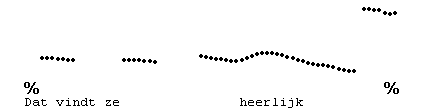
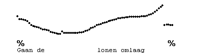
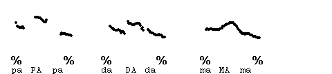
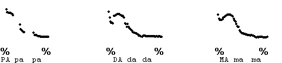
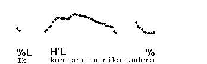

Pitch tracks vs auditory impression
-----------------------------------

Technically, **pitch** is the auditory sensation of the **periodicity** in the speech signal, the sequence of air pressure variations emitted by the speaker and impinging on the listener's eardrum. This periodicity amounts to repetitions of the same, or nearly the same, pattern of vibration. The pattern of vibration determines the sound quality (the vowel quality, say) that we perceive. The periodicity is determined by the **rate of vocal cord vibration**, the speed with which the vocal cords open and close, or vibrate. Rates of vibration in male speakers average around 125 Hz, while those in female speakers, whose larynxes are much smaller in the front to back dimension than those of men, average around 225 Hz, where "Hz" stand for the number of opening-and-closing actions per second. A speaker can change the rate of vocal cord vibration by making the vocal cords slacker (for lower rates) or tenser (for higher rates).

In this course, you will often see pitch tracks of the examples. These are produced by analysis programmes that take the speech signal as input and are sensitive to the periodicity in the signal caused by the vibrations of the vocal cords. Short of measuring these vibrations at the larynx itself with strap-on electrodes on the skin covering the larynx, this is our best estimate of how fast the vocal cords are vibrating. Nevertheless, they should be treated with caution, for a number of reasons:

1.  Pitch trackers make mistakes
    
    When the voice becomes creaky at lower pitches, the algorithm may be confused by peaks in the signal that do not derive from the vibratory action, and **doubling errors** may occur. Here is an example.
    
     
    
    Similarly, the algorithm may miss every second periodicity peak, 'believing' these peaks determine the sound quality rather than the periodicity. In such cases **halving errors** will occur. Here is an example.
    
     
    
    Doubling errors and halving errors are usually easy to detect; the pitch track shows a sudden change to a value half or double that of the immediately preceding value, and there is no auditory impression that corresponds to this jump. (No, our ears never make such errors in normal speech signals!)
    
    We hope that we have spotted, and corrected, all the doubling and halving errors that we encountered in the material in this course.
    
2.  Pitch tracks of voiced and voiceless consonants
    
    Pitch tracks will show no record during voiceless consonants, while voiced obstruents, particularly plosives like \[b,d\], may impede the airflow needed to keep the vocal cords vibrating, causing the periodicity to dip down. Because we do not perceive these effects intonationally, the same intonation contour will look rather different depending on the consonants in them. Compare the pitch tracks for "papapa", "dadada" and "mamama", pronounced with the same pitch.
    
     
    
     
    
3.  Effects of articulation
    
    The articulation of vowels and consonants may affect the tenseness of the vocal cords, and so interfere with the rate of vocal cords vibration. High vowels like \[i,u\] are pronounced with the tongue high in the mouth, causing the root of the tongue to pull up the forward part of the larynx to which the vocal cords are attached. For this reason, higher vowels will on average be pronounced with higher vibration rates than lower vowels, like \[a\]. We don't normally hear this type of difference, and it doesn't usually cause any problems when relating the pitch track to our auditory impression of the intonation.  
    Second, voiceless consonants like \[p,s\] are pronounced with an active opening gesture of the vocal cords, to ensure an open glottis. This gesture causes the vocal cords to be a little tenser than they are for the corresponding voiced consonants, with the result that the rate of vocal cord vibration immediately after a voiceless obstruent is on average a little higher than after voiced consonants. This effect is again cancelled out by the listener, but it can be very noticeable in a pitch track. In the following example, the pitch (in the technical, 'auditory' sense) smoothly goes from "niks" to "anders", but the pitch track shows a raised F0 after the \[s\] of "niks".
    
     
    

In general, you must train yourself to recognise intonation contours on an auditory basis. The pitch track will serve various functions during this process. In the beginning it may teach you basic things like whether the pitch goes up or down. Later, you will see how consonants may cause gaps in the tracks, or distort them in ways indicated above. And later still, you may learn to see in more detail how the physical appearance of the same intonation contour may vary according to the segmental structure.
