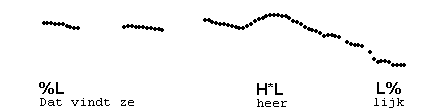
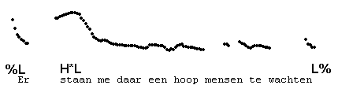
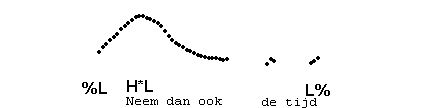

H\*L pitch accent
-----------------

The most neutral way of saying a one-word phrase like "Geschiedenis." is with low "Ge-", high "-schie-" and a fall to low through "-denis". We transcribe this contour with %L, H\*L (on the accented syllable), and L%.

Here are a few examples with low or mid initial pitch and one H\*L, in a variety of positions, and a variety of peak heights (prominences):

All items in Exercise 1A have one H*L pitch accent.
