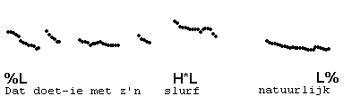
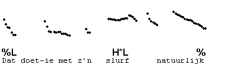
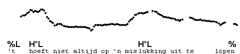
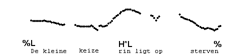
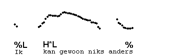
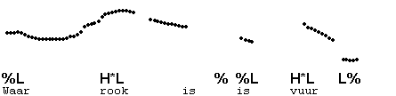

Final incomplete fall
---------------------

In this section, we will distinguish contours with H\*L L%, which fall to low pitch, from contours in which the final H\*L does not go firmly down to low pitch. Such contours are called 'half-completed falls'. First listen to a H\*L L% contour.

It often happens that speakers use a more gradual fall ending at mid pitch. The effect may be that the speaker sounds more tentative, or seems to express that what is said is not terrifically important. Listen to the following example and compare it with the previous one.

This half-completed fall is transcribed H\*L %. That is, the final boundary is just marked "%".

Here are some more examples:

In nonfinal IPs, such suspended falls may be used just to indicate non-finality. In the following example, the non-finality of the phrase "waar rook is" is indicated in this way:

