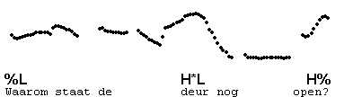
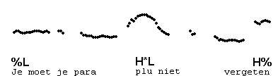
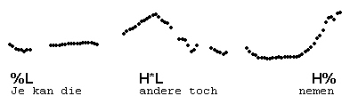
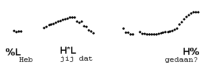
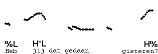
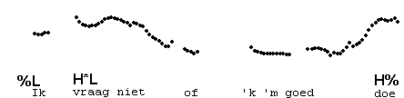
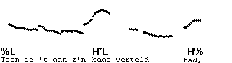
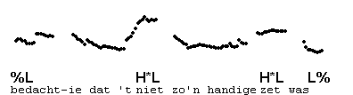
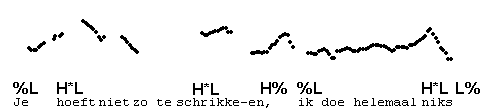

Final H% after H\*L
-------------------

In the examples so far, the pitch after the last H\*L went down to mid or low at the end of the intonation phrase. It is also possible to pronounce a boundary H%, in which case the last syllable has rising pitch, or is entirely pronounced with high pitch.  
Functionally, the occurrence of H\*L H% may signal a question, as in the first example, or a reminder, as in the second, or a suggestion, which may have a ring of self-evidence, as in the third.

It is this pattern which is often misanalysed as having an accent on the last word. This is "frequent error #1". Notice that the final syllable of the next utterance is high, but not accented:

An indication of the status of the high pitch is that it remains on the last syllable when the utterance is lengthened with an unaccented word.

Here is another example. The only pitch accent is on "vraag", and the final syllable "doe" has the H%. Again, we can see it is a boundary tone by replacing "doe" with "uitspreek" or "uitgesproken heb" or "uitgesproken heb deze keer", and see how the final high tone always goes to the last syllable, whatever it is.

Often, too, the sequence H\*L H% is used to signal nonfinality. In this case, the utterance consists of minimally two IPs, as in our next example. Listen to the whole utterance first.

Here is another example.

* * *

