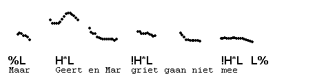
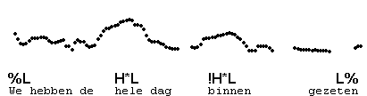
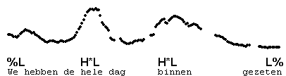
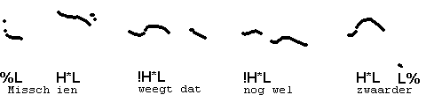
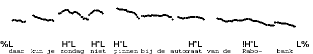
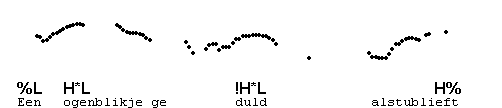
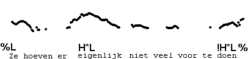

Downstepped H\*
---------------

Often, H\* is **downstepped** in falling contours. This means that the height of the tone is distinctly lower than that of a preceding H-tone.  
The difference between contours with a downstepped H\* and the same contours without the downstep is that the downstepped contour sounds more as if the speaker is not interested in further discussion of the point she makes in the utterance concerned. It thus has a 'final' ring about it.

Often, there are more than two H\*L's in an IP, in which case each H\* will be lower than the one before. In this contour, the pitch is low before each downstepped !H\*, due to L.

A downstepped H\* is symbolised !H\*.

Here is an example with three H\*L's: the second is downstepped relative to the first, and the third relative to the second.

In the following example, the same contour occurs with only two H\*L's, the second of which is downstepped.

Compare with the same utterance in which the same syllables are accented, but without downstep:

In sentences with more than two H\*L pitch accents, it may happen that only the pre-nuclear H\*L's are downstepped: the last H\*L goes all the way back up. Here is an example. (This speaker articulates his words very precisely and makes brief pauses between his words.)

Also, only the last H\*L's of a series are downstepped, as in the following example.

Although downstepped contours typically end fully low, they may also be ended by % and H%. Here is an example of H\*L !H\*L H%.

Another example.

