Downstep with spreading
-----------------------

Frequently, downstepped patterns are pronounced somewhat differently.

Listen to the following example.

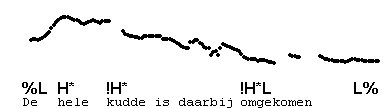

In this example, the high pitch for each H\* is extended until just before the next downstepped H\*, causing a terrace-shaped contour, with the beginning of each level of the terrace marking an accented syllable. This is known as **spreading** of H\*. Notice that only non-final H\*'s are spread in this type of contour.

Don't expect to see perfectly terraced contours in naturally spoken utterances. Often, they just seem to slither down, even though the auditory impression is that of accents stepping down.

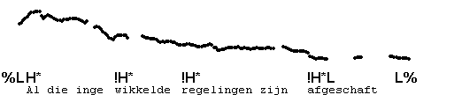

Compare with the same utterance which is also downstepped, but without spreading:

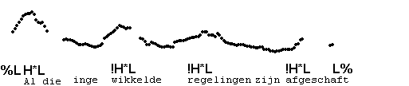

Downstepped contours with spreading can also end with % or H%, as in the following examples:

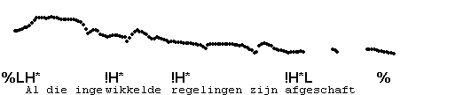

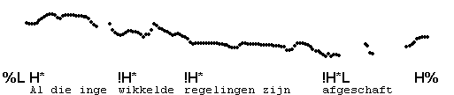

Here are some more examples, with varying numbers of accents. The first has three accents. Notice that the last one does not fall to fully low pitch, and we therefore transcribe it as a half-completed, downstepped H\*L. The second example has two accents, and ends with fully low pitch.

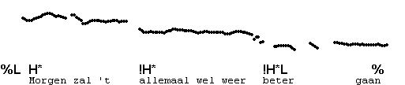

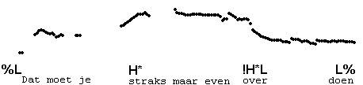

**Low pitch on !H\***

The pitch of the final downstepped H\* is usually very low, and may vary between just above fully low or fully low, without any difference in effect. In all such cases, we transcribe !H\*, even though the final accented syllable may be pronounced with fully low pitch.

This is the case in the next example, for instance. The word "huis" has fully low pitch; equivalently, it might have had a fall from mid to low, but all such contours have the same transcription.

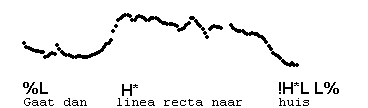

**Missing the last !H\*L**

When the last accent falls on the phrase-final word, it is often overlooked and misheard as low, unaccented pitch. This is "frequent error #2". In the following two examples, the final syllables "pot" and "uit" have downstepped !H\*L's.

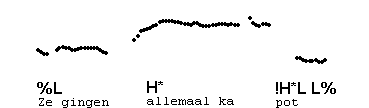

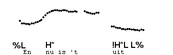

In particular when the accents occur on the last syllable, as in the above examples, the !H\*L's are mistaken for lack of accent because they are low-pitched. When we lengthen the utterances, it is in fact easier to hear the accents.

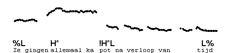

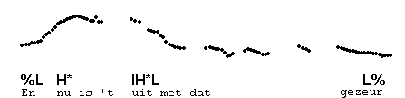

Here are three examples: "tegen", "dier" and "uit" are accented.

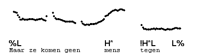

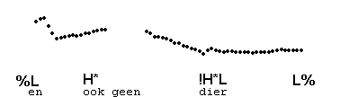

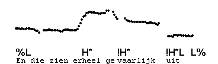

