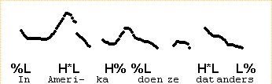
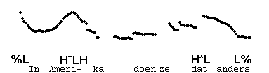
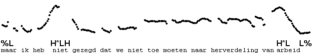
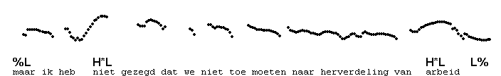
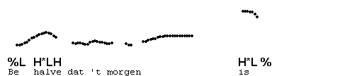

Pre-nuclear H\*LH
-----------------

The nuclear contour H\*L H% has a pre-nuclear version in which the boundary H% no longer functions as a boundary tone, but occurs just before the next pitch accent. Compare the pronunciation of the following example

in which "In Amerika" and "doen ze dat anders" are two IPs, with a pronunciation in which only single IP occurs:

The medial %L has disappeared, but these two contours are really equivalent, except for the absence of the medial IP-boundary in the second example, which causes H% to be timed like the L of H\*L: it moves to the right, causing a gradual rise. The L now occurs immediately after H\*.

The distance between the accents is larger in the following example, showing the gradual rise quite clearly.

When the first accent is pronounced with H\*L, we get a gradual fall, as usual. Notice that the intonation pattern is quite different.

Here is another example of an early pronunciation of the L in a pre-nuclear H\*LH.

