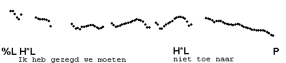
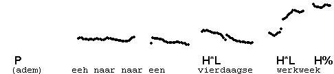

Transcription of pauses
-----------------------

It is sometimes thought that pauses always indicate IP boundaries. This is not the case. Speakers frequently interrupt their production in the middle of the IP, pause to think - apparently about what to say next - and then continue as if there had been no break at all. You may also reread our discussion of [phrasing](../0_about_this_course/0_4.html) in the introduction section of the course.

Examples of **hesitation** pauses, pauses that do not indicate phrase boundaries, are given in the following two utterances.

In such cases you may use the P symbol, aligned with the beginning of the pause. Pause fillers, like ehhh, are marked E.

<TABLE BGCOLOR="lightgrey" BORDER=0 CELLPADDING=4 CELLSPACING=0 WIDTH=40 onclick="play_sound('../audio/050g')">

<TR><TD ROWSPAN=2>
</TD>

<TD>En&nbspdan</TD><TD COLSPAN=2>zien&nbspze&nbspeen</TD><TD>hele</TD><TD>kudde</TD><TD>wilde</TD><TD>zwijnen</TD><TD COLSPAN=2>eeh&nbspstaan</TD>

<TD align=center ROWSPAN=2 WIDTH=40>&nbsp</TD>
<TD align=center ROWSPAN=2> <INPUT type="button" name="help" value=" Contour "
     onClick="window.open('../audio/gif/050g.gif')"></TD>
</TR>

<TR><TD>%L</TD><TD>H*L</TD><TD>&nbsp</TD><TD>H*L</TD><TD>!H*L</TD><TD>!H*L</TD><TD>!H*L</TD><TD>P-E-P</TD><TD ALIGN=RIGHT>L%</TD></TR>

</TABLE>

<TABLE BGCOLOR="lightgrey" BORDER=0 CELLPADDING=4 CELLSPACING=0 WIDTH=40 onclick="play_sound('../audio/051')">

<TR><TD ROWSPAN=2 WIDTH=40>
</TD>

<TD>Hoe</TD><TD>ze&nbspvan&nbspdie</TD><TD>zwijnen</TD><TD>af</TD><TD>&nbsp</TD><TD>kunnen&nbspkomen</TD>
<TD align=center ROWSPAN=2 WIDTH=40>&nbsp</TD>
<TD align=center ROWSPAN=2> <INPUT type="button" name="help" value=" Contour "
     onClick="window.open('../audio/gif/051.gif')"></TD>
</TR>

<TR><TD>%L&nbspH*L</TD><TD>&nbsp</TD><TD>H*</TD><TD>!H*L</TD><TD>P</TD><TD ALIGN=RIGHT>L%</TD></TR>
</TABLE>

Here is another example. Listen to the whole utterance first:

This utterance has a hesitation pause during which the speaker takes a breath:

* * *

