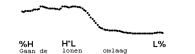
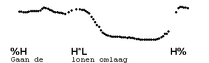
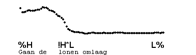

High preheads
-------------

The prehead may also be high-pitched. This type of prehead sounds quite different from the low prehead. It is usually high level, although it may also be slightly falling. This prehead is transcribed %H. It may sometimes be difficult to distinguish H% from an accent H\*.

### Downstep after %H

Initial %H may be followed by !H\*. The following example illustrates the way the title of a story may be read by someone reading a story to a group of children.

