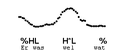

Falling preheads
----------------

A falling prehead is much rarer. It usually only occurs in a particular reading style, and makes the utterance sound lively. It is transcribed %HL.

%HL occurs in the following examples. They start with a fall and the accented syllable has H\*L:

