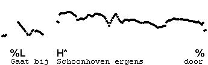
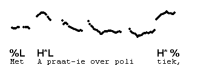
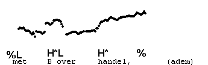
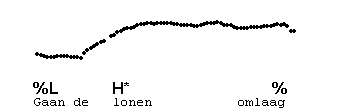
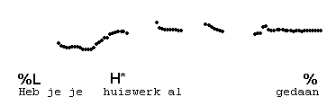
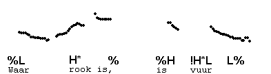
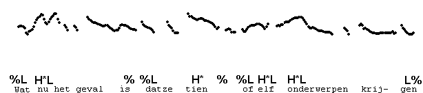

Level tone
----------

Many utterance-final pitch accents are variants of H\*L. However, there also a number of non-falling final pitch accents.

One of these consists of a level tone. A level pitch accent is transcribed H\*, followed by % if IP-final.

Physically, these level tones are not purely monotonous: the speaker may waver somewhat, but will avoid the impression of either a fall or a rise. Here is an example of a H\* on a non-final syllable, followed by %.

These level stretches after an accented syllable can be very short. In the following utterance, we have the H\* % contour twice, once on a final syllable and once on a penultimate syllable. The utterance is closed by %L H\* !H\*L L%.

Here are two more examples.

This example illustrates the use of H\* % to mark non-finality. Notice how the speaker continues with %H, an easy thing to do, as the pitch was high already.

Another example.

