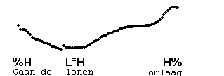
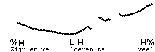
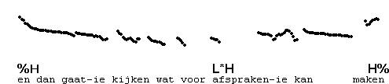

Low rises with H%
-----------------

If the accented syllable with a low rise is IP-internal, its pitch is low throughout. An IP-final accented syllable with a low rise has rising pitch.

The first type of low rise rises to mid pitch (in the next syllable, if there is one), and is followed by H%, a further rise at the end of the IP.

We transcribe: L\*H H%

The next example illustrates an IP with a high rise, followed by an IP with L\*H H%. Listen to the whole utterance first.

And here is an example of L\*H H% preceded by pre-nuclear H\*L.

