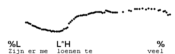
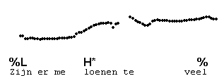
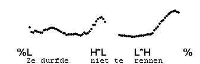

Low rises without H%
--------------------

The L\*H pitch accent also occurs without H%.This contour, L\*H %, is known as the half-completed rise.

The L\*H % contour is distinct from the level tone (H\* %), the high rise (H\* H%) and the low rise with H% (L\*H H%). Like H\* %, it may suggest continuation, and like L\*H H%, it has a fully low syllable. Compare the previous example with the following three examples.

The L\*H % is one of the many ways in which speakers indicate that another IP follows in the same utterance (continuation).

* * *

