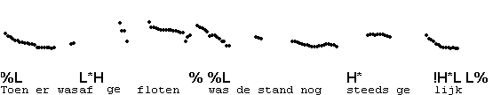
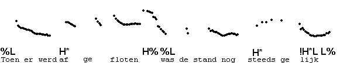
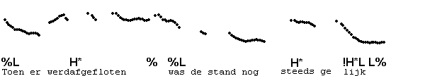
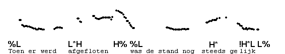

Some rises as markers of non-final IPs
--------------------------------------

We have come across quite a number of ways in which speakers can indicate that another IP follows. They are illustrated in the following examples, in part repeated from earlier sections. Notice that the IP-boundary need not have a pause, and that high pitch at the end of the first IP often spills over into the next.

