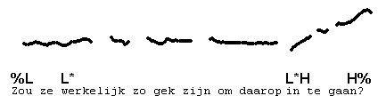
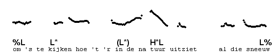
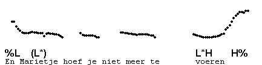

Singleton L\*
-------------

Pre-nuclear accented syllable can be low, after which the pitch continues low to a following (nuclear) accented syllable with low pitch. In spite of the low salience of the pitch, the impression of accent can be unmistakable.

In the next example, a singleton L\* can be heard on "kijken", and some may hear one on "in" as well. Notice that the contour would not be much different if we left the L\*'s out and considered "kijken" and "in" unaccented.

In other cases, the low pitched stretch may sound as if there are no accents. Not surprisingly, you may be in doubt if a L\* is really there. In the following example, we think there is no L\* on "Marietje", but you may think there is. In such cases, just make decision, and go on to the next item.

