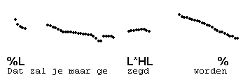
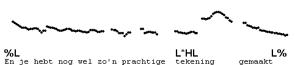
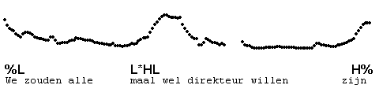

Prefix L\* or "delay"
---------------------

In a particular style of speech, which is sometimes used by speakers addressing children, H\*L may be prefixed with L\*. This means that the accented syllable has low pitch, which is then quickly followed by the pitch peak of H\*L. Because together, L\* and H\*L mark only a single accented syllable, we transcribe L\*HL. Of course, when IP-final, this pitch accent may be followed by %, H% or L%, depending of the pitch of the final boundary.

Examples:

